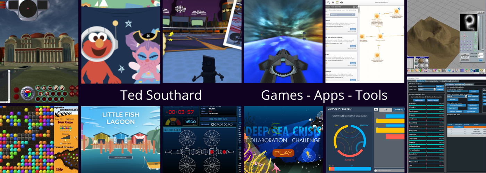

### I am a games/app engineer in New York City looking for remote opportunities in games, apps, web, etc.

- I work on codebases and teams large and small, in games or apps or web, because I just like to code and make things!
- 🔭 I’m currently working on some personal projects mostly revolving around neuro-inspired AI
- 🌱 I’m currently learning much about the same, as well as just upping my skills in various areas

### Read me

 

### Expertise
<h4>(★★★★★ - Expert, ★★★★ - Advanced, ★★★ - Proficient, ★★ - Working Experience, ★ - Learning/Familiarity)</h4>

 
 
 
 
 
 
 
 
 
 
 
 
 
 

#### Frameworks, Apps, and Stacks

  

  

 

#### Tools

  

  

  

### Open Source Projects

  

### Videos and links for Commercial Projects

 
 

 
 

 
 

 
 

 
 

 
 

 
 

## Blog posts
<!-- BLOG-POST-LIST:START -->
- [GDC 2023, and Other Things…](https://medium.com/@BablBrain/gdc-2023-and-other-things-3ffb25d8a8b)
- [AI/Dev Musings 11/21/2022](https://www.bablbrain.com/2022/11/21/ai-dev-musings-11-21-2022)
- [AI Musings for 6/8/2021](https://medium.com/@BablBrain/ai-musings-for-6-8-2021-40875c9af059?source=rss-b9478367f2ea------2)
- [AI Musings #2](https://medium.com/@BablBrain/ai-musings-2-13149aaae36a?source=rss-b9478367f2ea------2)
- [AI Musings #1](https://medium.com/@BablBrain/ai-musings-1-25a74a5e5604?source=rss-b9478367f2ea------2)
<!-- BLOG-POST-LIST:END -->
